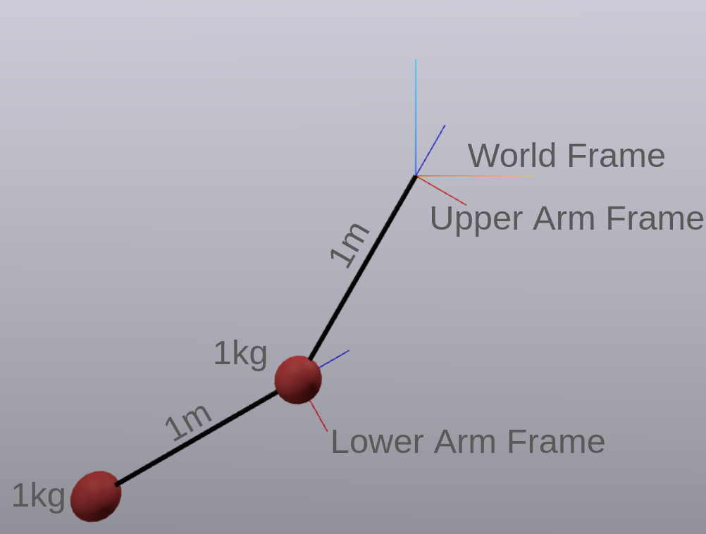

## Lesson 5: URDF Tutorial + Simulating Multibody Plant

In Lesson 4, you learned how to create a `LeafSystem` and then use `SceneGraph` to connect frames and geometries to it for visualization. Now, we will switch to using `MultibodyPlant` to handle all of the visualization and dynamics for us.

Drake is able to create a `MultibodyPlant` from a [URDF file](https://wiki.ros.org/urdf/XML/model). This is much easier and less error prone than creating a `MultibodyPlant` program completely in software.

### Task 1

Run the [sim_double_pend.py](sim_double_pend.py) script to simulate the double pendulum.

## URDF Tutorial

This mini-tutorial will walk you through creating a URDF file for a double pendulum (using point masses). We make the following assumptions about our model.
* The upper and lower arms are 1 meter long and massless.
* The point masses are 1 kg each.
* The upper arm pivots about the Y-axis (of the world frame) at the origin (of the world frame).
* The lower arm pivots about the Y-axis (of the upper arm frame) at the point mass of the upper arm frame.

Here is an illustration of the double pendulum we are creating. The angle of both pendulum arms is fixed at 30 degrees for clarity.


It is critical to understand the relationship between frames, links, and joints. Internalize the fact that the world frame and upper arm frame are in the same position, but the upper arm frame rotates relative to the world. Similarly, the lower arm frame is located 1 meter below the upper arm frame and rotates relative to the upper arm.

Now, we will create our first [URDF file](https://wiki.ros.org/urdf/XML). (You should go back and read this documentation later!)

### Links and Joints

[DP-1.urdf](DP-1.urdf) shows a very minimal description of the double pendulum, creating two links and two joints. 
```xml
<?xml version="1.0"?>
<robot name="DoublePendulum1">

  <link name="upper_arm"/>
  <link name="lower_arm"/>

  <joint name="shoulder" type="revolute">
    <parent link="world"/>
    <child link="upper_arm" />
    <axis xyz="0 1 0" />
    <!-- The upper arm is connected to the origin -->
    <origin xyz="0 0 0" />
  </joint>

  <joint name="elbow" type="revolute">
    <parent link="upper_arm"/>
    <child link="lower_arm" /> 
    <axis xyz="0 1 0" />
    <!-- The lower arm is connected 1 meter below the upper arm -->
    <origin xyz="0 0 -1" />
  </joint>

</robot>
```

* The `world` link always exists, is fixed in space, and located at the origin (0,0,0).
* We specify two new links: `upper_arm` and `lower_arm`
* We use joints to position a _child_ link relative to its _parent_ link, and specify its rotation axis in the _parent frame_.
    * `upper_arm` is connected to the origin and rotates about the _world_ y-axis
    * `lower_arm` is located 1 m below the `upper_arm` and rotates about the _upper arm_'s y-axis
* You can optionally add `dynamics` to your joint to simulate [damping and friction](https://wiki.ros.org/urdf/XML/joint).

<!-- At this point, the URDF can be parsed with the following code. However, we cannot simulate just yet because we haven't given the links any interial properties.
```python
meshcat = Meshcat()
builder = DiagramBuilder()
plant, scene_graph = AddMultibodyPlantSceneGraph(builder, time_step=0.0)
parser = Parser(plant)
parser.AddModels("DP-1.urdf")
plant.Finalize()
AddDefaultVisualization(builder, meshcat)
diagram = builder.Build()
``` -->
At this point, we have a URDF file which can be parsed by the MultibodyPlant parser. However, in order to simulate the plant we need to add inertial properties to the two links.

### Mass and Inertia

Each link can be given one `inertial` tag, which contains
* the location of the center of mass (called the `origin`), relative to the link (in the link's frame).
* the `mass` of the link (in kg)
* the moment of `inertia` (in kg-m2) about the center of mass


We modify the previous URDF file to include the appropriate `inertial` properties.
```xml
  <link name="upper_arm">
    <!-- add a point mass 1 meter below the frame -->
    <inertial>
      <origin xyz="0 0 -1" rpy="0 0 0" />
      <mass value="1" />
      <inertia ixx="0" ixy="0" ixz="0" iyy="0" iyz="0" izz="0"/> 
    </inertial>
  </link>

  <link name="lower_arm">
    <inertial>
      <origin xyz="0 0 -1" rpy="0 0 0" />
      <mass value="1" />
      <inertia ixx="0" ixy="0" ixz="0" iyy="0" iyz="0" izz="0"/> 
    </inertial>
  </link>
```
The location of the center of mass can be visualized by the red spheres in the figure above. We note that the `inertia` is set to zero because point masses have zero inertia about their center of mass.

At this point, you have enough in your URDF file to simulate your double pendulum! However, you will be disappointed that you can't see anything. This is because you haven't added any `visual` tags to your links. (See [DP-2.urdf](DP-2.urdf) for the URDF file up to this point.)

### Visualization

Each link can be given as many `visual` tags as you want. In our case, each link will have two different visual tags: one for the point mass (red ball) and another for the massless rod.

You can optionally declare `material` tags at the top of your URDF file. You must give the materials a unique name, and the color is specified as red-green-blue-alpha values from 0 to 1. Note that `alpha=0` corresponds to a completely transparent color.
```xml
  <material name="black">
    <color rgba="0 0 0 1" />
  </material>
  <material name="MITred">
    <color rgba=".6 .2 .2 1" />
  </material>
```

The code block below shows how to add the visualization elements.
```xml
  <link name="upper_arm">
    <!-- add a point mass 1 meter below the frame -->
    <inertial>
      <origin xyz="0 0 -1" rpy="0 0 0" />
      <mass value="1" />
      <inertia ixx="0" ixy="0" ixz="0" iyy="0" iyz="0" izz="0"/> 
    </inertial>

    <!-- draw the point mass -->
    <visual>
      <origin xyz="0 0 -1"/>
      <geometry>
        <sphere radius=".1"/>
      </geometry>
      <material name="MITred" />
    </visual>

    <!-- draw a connecting rod -->
    <!-- note: the cylinder will be centered around its center of volume -->
    <!-- and since the length of the rod is 1 m, we must have a -0.5 m offset -->
    <visual>
      <origin xyz="0 0 -.5" rpy="0 0 0" />
      <geometry>
          <cylinder length="1" radius=".01" />
      </geometry>
      <material name="black" />
    </visual>
  </link>
  <!-- similar for the lower arm -->
```
There are a few things to note here:
* Each visual element must be in its own `visual` tag.
* The `origin` tag specifies where the object will be drawn relative to the link's frame. This normally corresponds to the visual center of the `geometry` object.
* The sphere's origin is located at the center of mass.
* The cylinder's origin is located between the center of mass and the link's frame.
* Other geometry options are `box` and `mesh`. With a `mesh` you can specify an `.obj` file from CAD software.
```xml
<geometry>
    <mesh filename="meshes/Body_Subassembly_safe.obj" />
</geometry>
```
* You can read more about what you can do with links [here](https://wiki.ros.org/urdf/XML/link).

<!-- At this point, you can simulate the double pendulum and use meshcat to visualize the simulation.

```python
context = diagram.CreateDefaultContext()
context.SetContinuousState(np.deg2rad([30, 30, 0, 0]))  # Set initial state
simulator = Simulator(diagram, context)
simulator.Initialize()
simulator.set_target_realtime_rate(1.) # optional

meshcat.StartRecording()
simulator.AdvanceTo(5.0)
meshcat.PublishRecording()
``` -->
You now have created a valid URDF file which has inertial and visualization properties. (See [DP-3.urdf](DP-3.urdf) for the URDF file up to this point.)

### Transmissions

You can actuate the joints of a multibody plant in one of two ways. First, you can programmatically do this:
```python
elbow_actuator = plant.AddJointActuator(
    name="elbow_act",
    joint=plant.GetJointByName("elbow")
)
```

The other way to achieve a similar goal is to embed this information in the URDF.
```xml
  <transmission type="SimpleTransmission" name="elbow_trans">
    <actuator name="elbow_act" />
    <joint name="elbow" />
  </transmission>
```
Then you can connect to the newly created input port of the MultibodyPlant. (This example assumes you added actuation to both joints.)
```python
# vector_source[0] -> shoulder, vector_source[1] -> elbow
vector_source = builder.AddSystem(ConstantVectorSource([0.0, 5.0]))
builder.Connect(vector_source.get_output_port(), plant.get_actuation_input_port())
```

_Note_: there are actually two different methods for `get_actuation_input_port()` listed in the documentation: one with no arguments and one which requires a `ModelInstanceIndex`. In general, MultibodyPlants can have multiple models (i.e. multiple instances of the double pendulum). In cases where you have multiple models, you must specify which model you would like to actuate. In our case, there is no ambiguity.

(See [DP-4.urdf](DP-4.urdf) for the URDF file up to this point.)

### Collision Geometry

While not covered in this tutorial, you can specify collision geometry using URDF.

### URDF Extensions

While not covered in this tutorial, there are Drake Extensions of the URDF format which you can read [here](https://drake.mit.edu/doxygen_cxx/group__multibody__parsing.html).

### SDFormat

Another alternative to URDF is called SDFormat (SDF), which is used for the Gazebo simulator. It has more options than URDF, but a steeper learning curve. [Here is an example](https://github.com/RobotLocomotion/drake/blob/master/multibody/benchmarks/acrobot/acrobot.sdf).

## MultibodyPlant

The [MultibodyPlant](https://drake.mit.edu/doxygen_cxx/classdrake_1_1multibody_1_1_multibody_plant.html) is one of the best features of Drake. However, it has an enormous amount of capability that one cannot simply learn in a few hours. 

The basic idea of MultibodyPlant is that is a system for modeling a collection of interconnected bodies. For example, the double pendulum has two bodies (upper and lower arms), plus the world body (which is always present). A MultibodyPlant can be created either programmatically or by loading a URDF/SDF file. By using a parser and a URDF/SDF file, the rigid bodies and their relationships amoung each other are created automatically, and connections are made to a `SceneGraph` for visualizing the appropriate geometry.

### Simulating a MultibodyPlant

The code below shows you how to create a MultibodyPlant from a URDF file. There are really only four lines (3-6) of code you need to add from what you learned in Lesson 1.
```python
meshcat = Meshcat()
builder = DiagramBuilder()
plant, scene_graph = AddMultibodyPlantSceneGraph(builder, time_step=0.0)
parser = Parser(plant)
parser.AddModels("DP-3.urdf")
plant.Finalize()

AddDefaultVisualization(builder, meshcat)
diagram = builder.Build()

# Set initial conditions
context = diagram.CreateDefaultContext()
context.SetContinuousState(np.deg2rad([30, 30, 0, 0]))

# simulate the multibody plant
simulator = Simulator(diagram, context)
simulator.Initialize()
simulator.set_target_realtime_rate(1.) # optional
meshcat.StartRecording()
simulator.AdvanceTo(5.0)
meshcat.PublishRecording()
```

### MultibodyPlant Introspection (Task 2)

On the [MultibodyPlant documentation](https://drake.mit.edu/doxygen_cxx/classdrake_1_1multibody_1_1_multibody_plant.html), search for `Introspection` and browse the different functions available within the Introspection section. Then, run the script [introspect_double_pend.py](introspect_double_pend.py) and analyze the output. What are the rigid bodies in the plant? How many are there? Etc.

### SceneGraphInspector (Task 3)

When the MultibodyPlant is created, many changes are made to the `SceneGraph`. Because it is so useful to be able to debug the `SceneGraph`, there is actually a [SceneGraphInspector](https://drake.mit.edu/doxygen_cxx/classdrake_1_1geometry_1_1_scene_graph_inspector.html) which you can access via the command:
```python
inspector = scene_graph.model_inspector()
```

Browse some of the functions in the documentation above, and then read through and run [inspect_double_pend.py](inspect_double_pend.py) for each iteration of the URDF file in this tutorial: `DP-1.urdf`, `DP-2.urdf`, and `DP-3.urdf`. Try to understand what additions are occurring between each iteration of the URDF.

### Task 4

Now that you are familiar with URDF, MultibodyPlant, and SceneGraph, complete the following tasks.

1. Create a triple pendulum (`TP.urdf`) and simulate it.
2. Modify the lengths of the triple pendulum in the URDF code.

### Extensions

TODO (multiple models in one multibody plant)


### Next Steps

[Lesson 6](../Lesson-6/)